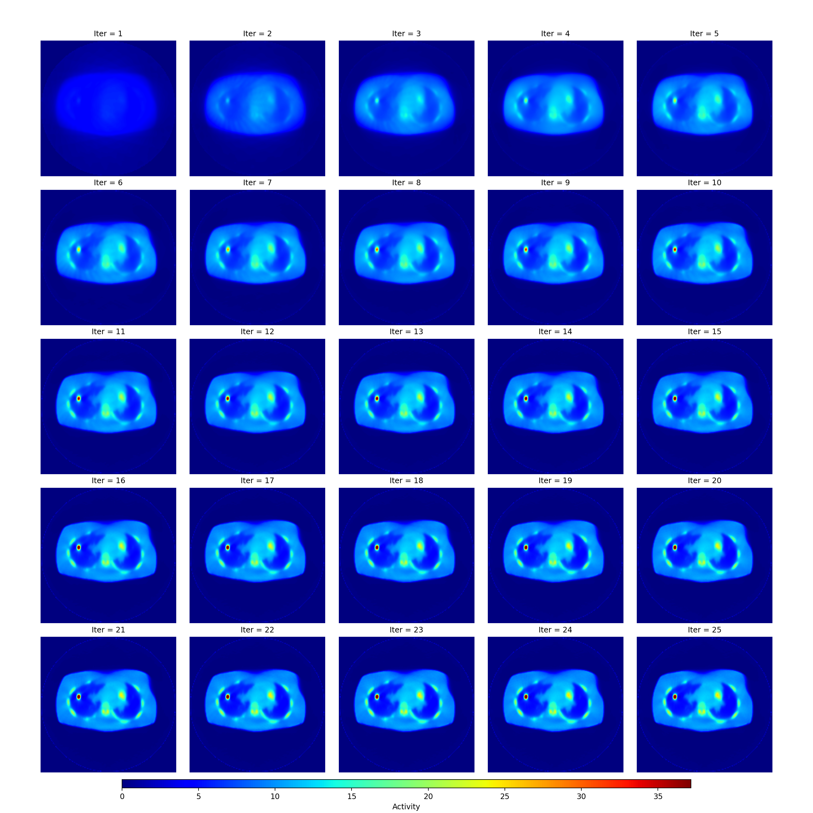

# SIRF基础用法


## 导入PET模块

```python
import sirf.STIR as pet
```
也可以
```python
from sirf.STIR import *
```
这样在之后每次使用内部函数时候都不需要再用pet.什么什么的函数。直接用就可以。

## 阅读PET图像`pet.ImageData`

从磁盘上阅读一份医学影像文件，变成SIRF可以操控的对象
```python
image = pet.ImageData('your_pet_data_file.hv')
```


## 射线追踪重构Sinogram

使用射线追踪方法，本质上就是把PET上面的亮点当做CT里面密度最高的点看待，对于二维图像扫描构建到sinogram
也可以通过蒙特卡洛方法模拟，这样就会是比较准确的sinogram
此方法只是构建一个转化成sinogram的模具工厂，之后可以在这个模具里面进行各种不同的操作

```python
acq_model = pet.AcquisitionModelUsingRayTracingMatrix()
```
如果是使用衰减图，同样地，初始化一个射线追踪模型：

```python
acq_model_for_attn = pet.AcquisitionModelUsingRayTracingMatrix()
```


### `pet.AcquisitionData`用法

`pet.AcquisitionData` 是 SIRF 中专门用来处理 PET 中 sinogram 的函数。

#### 作为模版阅读探测几何使用

它可以用作模板，指定一种投影数据格式（如几何结构、分层数、采样方式等），比如只读取模板文件，只关心文件内的探测器几何结构，不关心具体的采集数据。

示例代码：

```python
import sirf.STIR as pet
import os

# 假设你的数据文件夹叫 data_path，里面有 template_sinogram.hs
data_path = '/your/data/folder'

# 只用模板的格式，不关心具体内容
template = pet.AcquisitionData(os.path.join(data_path, 'template_sinogram.hs'))#其中os.path.join表示用完美方式缝合路径和文件

print("模板投影数据格式：")
print("尺寸 shape:", template.shape())
print("每个维度数量:", template.dimensions())
print("类型 type:", type(template))
```

则输出为

```text
模板投影数据格式：
尺寸 shape: (31, 252, 128)
每个维度数量: (31, 252, 128)
类型 type: <class 'sirf.STIR.AcquisitionData'>
```
当然，正如数据类型章节所说的，[点击查看医学图像数据的区别](pictype.md#hv-文件和-hs-文件-和-v-文件-和-s-文件-hvhsdata)，也可以对于头部文件直接进行数据处理，内部算法会直接处理相应的完整数据。

##### 同样作为探测器几何，但是不是读取一个文件内容，而是自己构造一个探测器几何，用于修剪更改压缩内容


```python
template_acq_data = AcquisitionData('Siemens_mMR', span=11, max_ring_diff=15, view_mash_factor=2)
```
注意这里就是没有用pet.AcquisitionData, 因为之前规定的是from sirf.STIR import *，

'Siemens_mMR'是机器系统名字，span表示压缩因子，等于11就是把11个环差的数据都压缩到一个平面上。max_ring_diff=15只统计小于15的环差的数据，本来有60这里就不统计。

##### `.write`用法

在SIRF里面 .write表示把前文档输出成后面括号带有的后缀形式，就是这么简单

```python
some_data_object.write(<filename>)
```
或者更加具体地说

```python
reconstructed_image.write('OSEM_result.hv')
```
就会产生两个文件，一个是'OSEM_result.hv'，一个是'OSEM_result.v'


#### `AcquisitionSensitivityModel`用法
如果是处理带衰减图的数据，同样地在这里配置：注意，这个AcquisitionSensitivityModel会根据输入结果的不同产生不同的东西，如果输入体素图他就会产生一个衰减图sinogram数据，不过如果输入一个sinogram，它就会配置一个之后每次前投和背投都会把这个sinogram当做衰减图的操作。

```python
attn_image = pet.ImageData(os.path.join(data_path, 'attenuation.hv'))
asm_attn = pet.AcquisitionSensitivityModel(attn_image, acq_model_for_attn)
```
#### `.set_up`操作

使用`.set_up`配置文件，才能进行下一步操作，如下代码，抽取了体图像和sinogram的头文件配置进行下一步操作

```python
acq_model.set_up(template, image) #注意这里只有配置没有赋值给任何代码
```
同样配置衰减图：使用衰减模型时不需要配置image

```python
asm_attn.set_up(template)
```
#### 前投和背投 `.forward`和`.backward`

接下来就可以对数据进行前投，用图像产生sinogram：

```python
acquired_data = acq_model.forward(image)
```

也可以产生背投，指的是sinogram变成图像：

```python
acquired_data = acq_model.backward(image)
```

## 配置相关衰减图和噪声

在sinogram里面计算衰减图对于每个bin的衰减，之后每次只需要乘上这个sinogram就行，就可以得到每个bin的衰减

计算敏感度因子，使用sinogram前投sinogram，首先创造全1的格式相同的sinogram，然后对于这个在衰减模型里面做前投就会得到一个每条衰减因子的系数，也就是说在这个特殊的模型里，就是前面配置的AcquisitionSensitivityModel模型里面，如果对sinogram进行前投还是会得到sinogram，不过得到一个衰减比例的sinogram，比如一个像素点本来是1，衰减后到达探测器其实只有0.67了，那么这个前投以后就会把这个像素点的值变成0.67。
```python
attn_factors = asm_attn.forward(template.get_uniform_copy(1))
```

然后创建新的敏感图模型，这样每次投影都会乘上衰减因子，每次前投后投，暂且当做固定用法。

```python
asm_attn = pet.AcquisitionSensitivityModel(attn_factors)
```
然后在主模型里面引用它，

```python
acq_model = pet.AcquisitionModelUsingRayTracingMatrix()
# 可选：提高每条 LOR 的射线数目以模拟更精细的射线追踪
acq_model.set_num_tangential_LORs(5)
# 把刚才的衰减敏感度模型绑定进采集模型
acq_model.set_acquisition_sensitivity(asm_attn)
# 准备几何信息
acq_model.set_up(template, image)
```

 —— 后续投影时就会自动 proj * attn_factors ——  

 ```python
acquired_data = acq_model.forward(image)
```

### 加入背景噪声

 ```python
# 1. 生成一个全图像都相同值的背景 sinogram
background_term = acquired_data.get_uniform_copy(acquired_data.max() / 10)

acq_model.set_background_term(background_term)
# 2. 重新模拟
acquired_data = acq_model.forward(image)
```

## OSMAPOSL算法相关

#### 创造计算两幅Sinogram相似度的泊松对数相似函数

```python
obj_fun = pet.make_Poisson_loglikelihood(acquired_data)
```
借此创造一个函数赋值为obj_fun可以利用泊松对数相似函数计算两幅sinogram之间的区别，这个是在PET中的特殊用法，在其他图像中一般我们直接乘除就可以。这个函数算出来的结果一般是负值，数值越接近0，说明两个sinogram越相似。

#### 配置投影方式
```python
obj_fun.set_acquisition_model(acq_model)
#这里的acq_model是指前面的acq_model = pet.AcquisitionModelUsingRayTracingMatrix()，
#如果sinogram的采集方式都不一样，那不是贻笑大方了
```

#### 使用OSMAPOSLReconstructor()构建重构器

配置重构器，使用OSMAP-OSL 算法，即Ordered Subsets MAP One-Step-Late，是OSEM的升级版本

```python
recon = pet.OSMAPOSLReconstructor()
```

为重建器配置目标
```python
recon.set_objective_function(obj_fun)
```

设置分割子集

```python
recon.set_num_subsets(4)
```

设置子迭代次数

```python
num_subiters = 60
recon.set_num_subiterations(num_subiters)
```


##### 设置初始化图

设置一个图像大小和image相同，数值均匀的自定义图像：

```python
initial_image = image.get_uniform_copy(cmax / 4) #得到一个图像

recon.set_current_estimate(initial_image) #设置这个图像为初始图像

```

准备重建器

```python
recon.set_up(initial_image)
```

开始执行

```python
recon.process()
```

取出重建结果

```python
reconstructed_image = recon.get_output()
```

写出结果到文件

```python
reconstructed_image.write('OSEM_result.hv')
```

也可以输出另外格式

```python
reconstructed_image.write('out.mhd', write_par='stir_to_mhd.par')
```


## ImageData 类相关的操作

**说明：**  
下面的示例代码统一用 `image` 作为 PET 图像对象的变量名，这来自于初始约定：

```python
image = pet.ImageData('emission.hv')
```


### 获取图像维度尺寸

```python
image.dimensions()    # 可能输出 (64, 128, 128)
```


### 使图像变成三维数组

```python
arr = image.as_array()
```


## 结果展示

### 使用 OSMAP-OSL 算法迭代重建 30 次——理想图




##  使用真实数据来构建

本系列基于ucl的mMR 获取的PET/MR数据来操作真实数据的图像重建


### 数据准备

首先使用在代码格里面模仿shell操作的代码来进行操作，这个cp 在unix/linux里面表示 复制一个文件到另外一个文件路径，主要形式功能就是从源文件夹位置复制到工作文件夹位置，使用方法是cp <源文件路径> <目标文件路径>
，在这里 $data_path/20170809_NEMA_UCL.n.hdr是原始路径而norm.n.hdr表示名字，因为之前已经定位了路径所以会在工作路径下创造一个此名字文件
```python
!cp $data_path/20170809_NEMA_UCL.n.hdr norm.n.hdr
```

使用SIRF里面自带的函数来处理转化收集到的数据到SIRF可以处理的格式
```python
!convertSiemensInterfileToSTIR.sh $data_path/20170809_NEMA_MUMAP_UCL.v.hdr umap.v.hdr
```

修剪其中数据，更加符合格式，具体原理之后再论述
```python
# These files will sometimes have lines terminated with CR instead of CRLF, fix this
# This just means, if we see CR<character> and <character> isn't LF, replace it with CRLF<character>
!sed -i.bak "s/\r\([^\n]\)/\r\n\1/g" norm.n.hdr
!sed -i.bak "s/\r\([^\n]\)/\r\n\1/g" umap.v.hdr
```

在header中插入数据的绝对路径


```python
# Now add absolute data path to the header file
# This command prepends the data path to the data file so that the header in our working folder points to the data
# You won't need to do this for your own data if the data file is in the same directory.
!sed -i.bak2 -e "s#\(!name of data file:=\)#\\1{data_path}/#" umap.v.hdr
!sed -i.bak2 -e "s#\(!name of data file:=\)#\\1{data_path}/#" norm.n.hdr
```

执行更改后的变化，不重要，仅浏览

```python
10c10,13
< !name of data file:=20170809_NEMA_MUMAP_UCL.v
---
> !name of data file:=/home/jovyan/work/SIRF-Exercises/data/PET/mMR/NEMA_IQ/20170809_NEMA_MUMAP_UCL.v
> 
> !GENERAL IMAGE DATA :=
> !type of data := PET
12d14
< !GENERAL IMAGE DATA:=
15c17
< image data byte order:=LITTLEENDIAN
---
> imagedata byte order:=LITTLEENDIAN
27,29c29,31
< scale factor (mm/pixel) [1]:=2.08626
< scale factor (mm/pixel) [2]:=2.08626
< scale factor (mm/pixel) [3]:=2.03125
---
> scaling factor (mm/pixel) [1]:=2.08626
> scaling factor (mm/pixel) [2]:=2.08626
> scaling factor (mm/pixel) [3]:=2.03125
37,38c39,41
< !image duration (sec):=0
< !image relative start time (sec):=0
---
> number of time frames:=1
> !image duration (sec)[1]:=0
> !image relative start time (sec)[1]:=0
77a81
> !END OF INTERFILE :=
```